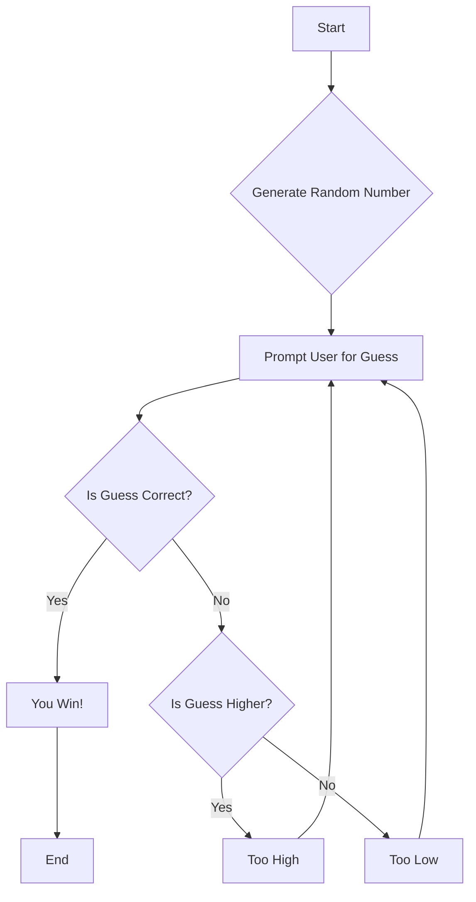

```mermaid
flowchart TD
    A[Start] --> B{Generate Random Number}
    B --> C[Prompt User for Guess]
    C --> D{Is Guess Correct?}
    D -- Yes --> E["You Win!"]
    E --> F[End]
    D -- No --> G{Is Guess Higher?}
    G -- Yes --> H["Too High"]
    H --> C
    G -- No --> I["Too Low"]
    I --> C
```
