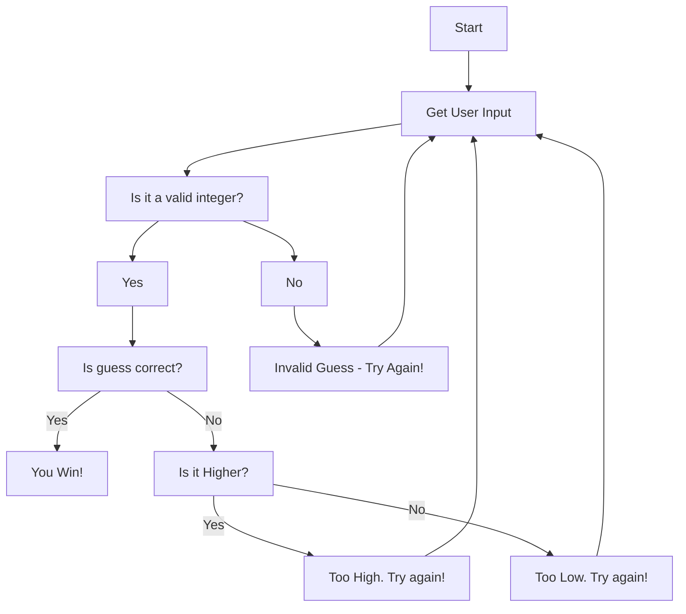

```mermaid
flowchart TD
    A[Start] --> B[Get User Input]
    B --> C["Is it a valid integer?"]
    C --> Yes -->F["Is guess correct?"]
    C --> No --> E["Invalid Guess - Try Again!"]
    E --> B
    F -- Yes --> H["You Win!"]
    F -- No --> G["Is it Higher?"]
    G -- Yes --> I["Too High. Try again!"] -->B
    G -- No --> J["Too Low.  Try again!"] -->B
    
```
